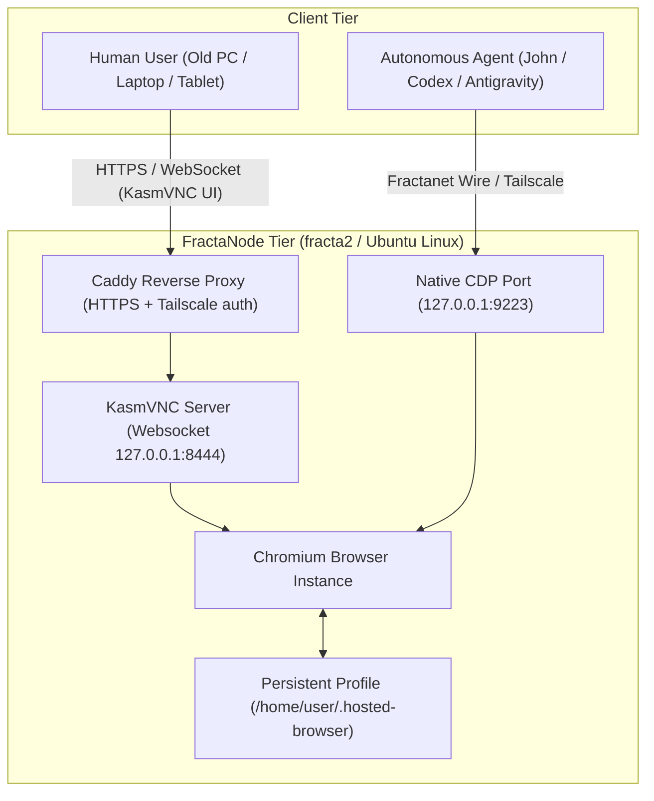

# Hosted Browser POC Architecture

## 1. Vision & Core Invariant

The Hosted Browser decouples personal browsing and agent automation from physical client hardware:

> **The personal environment belongs to the person, not to the physical terminal.**

A Hosted Browser session provides two symmetric access surfaces to the same underlying browser state:
1. **Human Interaction Surface**: Ultra low-latency web UI via **KasmVNC** (open-source GPL-2.0).
2. **Machine Automation Surface**: Scoped, local-only **Chrome DevTools Protocol (CDP)** for autonomous agents.



---

## 2. Multi-User Isolation & Security Constraints

* **Strict Unix Account Separation**: Each user operates under a dedicated Unix UID (e.g. `hosted-jhr`, `hosted-pilot`).
* **Profile Privacy**: `chmod 700 /home/${USER}/.hosted-browser`. Cookies, session tokens, and localStorage never leak across users.
* **CDP Scoping**: CDP is bound exclusively to `127.0.0.1` or the Fractanet Tailscale mesh. It is **never** exposed to the public Internet.
* **Exclusion of Kasm Workspaces**: The deployment intentionally uses only standalone **KasmVNC (GPL-2.0)** without proprietary Kasm Workspaces or heavy Docker/OCI layers.

### Generic workspace provisioning

Use `scripts/ops/provision-hosted-browser-user.sh` after the node-level
KasmVNC templates are installed. It derives a stable Unix workspace from a
canonical Gmail address, allocates an explicit display, and requires existing
private KasmVNC and RFB password files. It never receives a Google password,
creates a Google account, or performs a Google sign-in.

```bash
sudo scripts/ops/provision-hosted-browser-user.sh \
  --gmail person@gmail.com \
  --display 3 \
  --kasm-password-file /root/private/person.kasm \
  --rfb-password-file /root/private/person.rfb \
  --dry-run
```

Remove the final `--dry-run` only after confirming that the display is unused
and the supplied password files contain the intended private credentials. The
web-facing Caddy route is a separate operational decision: a newly provisioned
workspace is not automatically made public.

### Provisional personal-workspace acceptance flow

Before a Hosted Browser is assigned to a named person, validate the service
with a synthetic, non-personal acceptance workspace. This tests the technical
and user-facing contract without creating a Twin representation, an external
identity, a `subject_ref`, or a Principal binding.

The logical-Twin lifecycle is defined by the
[Provisional Twins & Fractal Multi-Instance Architecture specification](https://github.com/JeanHuguesRobert/inseme/blob/main/docs/provisional-twins-multi-instance.md).
This operational procedure applies that lifecycle to Hosted Browser workspaces;
it does not replace it.

| Phase | Workspace status | Required boundary | Exit condition |
|---|---|---|---|
| 0 — Synthetic acceptance | Test fixture; not a Twin representation | No named subject, external identity, Principal, personal trace, or production credential | All acceptance criteria below are evidenced and the fixture can be removed without residue |
| 1 — Named provisional workspace | Logical Twin is `provisional`; `principal_id = null` | A host may provide capacity and inheritable defaults, but never identity, mandate, private memory, browser profile, credentials, or CDP authority | A verified claim may bind a Principal without changing the logical Twin identity |
| 2 — Claim and promotion | Claimed Twin, then independently promoted as needed | Information hydration and infrastructure isolation are distinct decisions | The responsible Principal approves the required scope and isolation level |

For a future French Senior-facing workspace, the interface locale is an
explicit per-workspace configuration. It is not inferred from a Unix account
name, a browser login, or a represented subject. Shared implementation
artifacts remain in English.

#### Phase-0 acceptance criteria

- The selected interface locale is rendered consistently in menus and
  user-facing session guidance.
- The test workspace is isolated from every personal Unix account, browser
  profile, VNC credential, and CDP endpoint.
- CDP remains local or explicitly scope-controlled; it is never granted to the
  test user by default.
- A user logout or KasmVNC failure cannot leave the public route in a lasting
  HTTP 502 state; the listener health check detects and recovers the service.
- No trace from the fixture is promoted into a person’s Twin history.
- The test evidence is recorded in a bounded operational handoff without
  credentials or personal data.

---

## 3. Checkpoints & Verification Criteria

| Checkpoint | Target Property | Verification Method | Status |
|---|---|---|---|
| **Checkpoint A** | Resilient FractaNode baseline | Host online on Tailscale mesh, zero swap pressure, monitored by Operium. | ✅ Validated |
| **Checkpoint B** | Persistent Single-User Session | Human logs into services (Gmail/ChatGPT/X), restarts systemd service, verifies session persistence. | ✅ Validated |
| **Checkpoint C** | Multi-User Independence | 2 separate users running simultaneously on distinct displays/ports with zero cross-talk. | ✅ Validated |
| **Checkpoint D** | Dual Human/Machine Control | Human interacts via KasmVNC while local script navigates, detects active profile (`@suvranu`), and extracts session cookies via CDP (:9223). | ✅ Validated (2026-09-01) |
| **Checkpoint E** | Pivot Node & Multi-Browser Support | Hosted browser deployed on `fracta` pivot with native Brave Browser, CDP :9223, KasmVNC :8444, and local Caddy reverse proxy. | ✅ Validated (2026-09-08) |
| **Checkpoint F** | Migration to Ampere A1 (ARM64) & Mesh Routing | Fresh `fracta2` deployed on `VM.Standard.A1.Flex` (2 OCPU, 12 GB RAM), Brave ARM64 + KasmVNC ARM64, Caddy mesh reverse proxy, and ONA node agent online. | ✅ Validated (2026-09-09) |
| **Checkpoint G** | Native RFB Projection & Public VNC Access | Out-of-trust-perimeter standard VNC routing via `browser.fractavolta.com` (ports 5900/5901) to `fracta2` RFB projection daemon without Tailscale. | ✅ Validated (2026-09-10) |


### Live Evidence for Checkpoint D (`fracta2` — 2026-09-01)
- **Tooling :** `scripts/ops/cdp-browser-cli.js --whoami`
- **Result :** Active X.com DOM inspected via CDP over WebSocket on `127.0.0.1:9223`. Successfully resolved profile `@suvranu`, extracted `auth_token` and `ct0` into local secrets vault in <100ms.
- **Reference Doc :** [`cogentia/docs/cdp_hosted_browser_session_bridge.md`](../../cogentia/docs/cdp_hosted_browser_session_bridge.md)

### Live Evidence for Checkpoint E (`fracta` Pivot — 2026-09-08)
- **Engine :** Brave Browser (`/usr/bin/brave-browser` v1.94.121) + Openbox + KasmVNC 1.5.0.
- **Multi-Browser Architecture :** `start-hosted-browser.sh` automatically detects and supports Brave Browser, Google Chrome, and Chromium, with optional `HOSTED_BROWSER_BINARY` environment override.
- **Routing :** `browser.fractavolta.com` re-routed on `fracta` to local port 8444 with HTTP Basic / Websockify authentication.
- **Sync Capability :** Brave Sync enabled for seamless profile and bookmark synchronization with operator workstation.
- **Observed Footprint :** Idle memory ~476 MiB used / 421 MiB available on `fracta`, load average ~0.13.

### Live Evidence for Checkpoint F (`fracta2` Ampere A1 — 2026-09-09)
- **Hardware Shape :** `VM.Standard.A1.Flex` (2 OCPUs, 12 GB RAM, 3.0 GHz Ampere Altra ARM64) on OCI Marseille.
- **Zero-Cost Budget Guard :** Account converted to PAYG with strict 1.00 €/month OCI budget alert rules (100% actual + 100% forecast spend alerts) to guarantee 0.00 € spend.
- **Software Stack :** Brave Browser ARM64 v1.94.121 + KasmVNC ARM64 v1.5.0 + Caddy + Operium Node Agent (Node.js 22.23 LTS).
- **Service Continuity :** Full user profile (102 MB) migrated through pivot pattern (`fracta2` old -> `fracta` -> `fracta2` Ampere A1).
- **Network Routing :** Caddy on `fracta` reverse-proxies `browser.fractavolta.com` over Tailscale mesh (`100.84.109.87:80`), where local Caddy forwards to KasmVNC (`127.0.0.1:8444`). Native CDP bound to `127.0.0.1:9223`.
- **Live Fleet Agent :** ONA online on port 8794 publishing SOMA descriptor `resource://fracta2`.
- **Observed Footprint :** ~830 MiB RAM used / 11+ GiB available, 0 MB swap used, system load average 0.09.

### Live Evidence for Checkpoint G (Native RFB & Public VNC Routing — 2026-09-10)
- **Problem Addressed :** KasmVNC web UI is too resource-heavy for vintage / ultra-light client PCs. Standard RFB allows ultra-light native VNC viewers (TigerVNC, TightVNC, UltraVNC, Remmina).
- **Out-of-Trust-Perimeter Access :** No Tailscale or VPN required on the client machine. Standard VNC connects directly to public hostname `browser.fractavolta.com` on standard port 5900 (display :0 default) or 5901 (display :1).
- **Architecture & Routing :**
  - OCI Default Security List updated with stateless=false TCP ingress rule on ports 5900-5901 from `0.0.0.0/0`.
  - Public node `fracta` (`82.70.234.207`) runs native systemd socket proxy `vnc-proxy-fracta2.socket` + `systemd-socket-proxyd` forwarding public incoming TCP ports 5900 and 5901 across the WireGuard mesh to `100.84.109.87:5911` (`fracta2`).
  - Target node `fracta2` runs native RFB projection daemon `hosted-browser-rfb@hosted-jeanhuguesrobert.service` attaching `x11vnc` directly to the live X11 display `:1`.
- **Authentication :** Standard RFB VncAuth password; no credential value belongs in this document.
- **Client Artifacts :** Workstation desktop shortcuts and connection profile `Fracta2 Desktop.vnc` (associated with TightVNC Viewer) and `Fracta2 Desktop (TigerVNC).lnk`.
- **Resource Footprint :** `x11vnc` daemon runs at ~0.0% CPU and ~30 MiB RSS when idle, introducing negligible overhead.
- **Operator Live Verification (2026-09-12) :** Human operator testing confirmed that the out-of-trust-perimeter standard VNC path operates reasonably well ("marche raisonnablement bien"). Standard RFB viewers connect directly to `browser.fractavolta.com` (ports 5900/5901) without Tailscale, successfully authenticate via standard RFB password prompt (without requiring username fields in legacy RFB viewers), and provide a functional, lightweight browsing experience.

---

## 4. Resource Baseline & Performance Targets
 
* **Idle footprint per user**: ~180 MB RAM (Chromium base + KasmVNC daemon).
* **Active browsing footprint**: ~450 MB – 850 MB RAM per active tab cluster.
* **Network consumption**: ~15–40 KB/s during text typing/reading; ~120 KB/s on full redraws.

### Observed Live Baseline (`fracta2` — 2026-08-26)

| Parameter | Observed Live Value | Notes |
|---|---|---|
| **Host / OS** | `fracta2` · Ubuntu 24.04 LTS (x86_64) | OCI Marseille `VM.Standard.E2.1.Micro` |
| **KasmVNC** | v1.5.0-1 | Port :8444 / HTTP :80 via Caddy |
| **Chromium Engine** | Google Chrome 152.0.7977.64 | CDP :9223 active |
| **Window Manager** | Openbox lightweight WM | Minimal memory footprint |
| **Framerate & Codec** | 24 FPS · JPEG `quality: 6` | `nearest` video encoder, low CPU overhead |
| **Memory Allocation** | 1 GB RAM + 4 GB NVMe Swap | 432 MB free RAM nominal |
| **CPU Utilization** | **~91% CPU Idle (0% Steal)** | Stable under continuous session |
| **Control Plane** | ONA (:8794) + SOMA discovery | Advertises to fracta Blackboard every 3 min |
