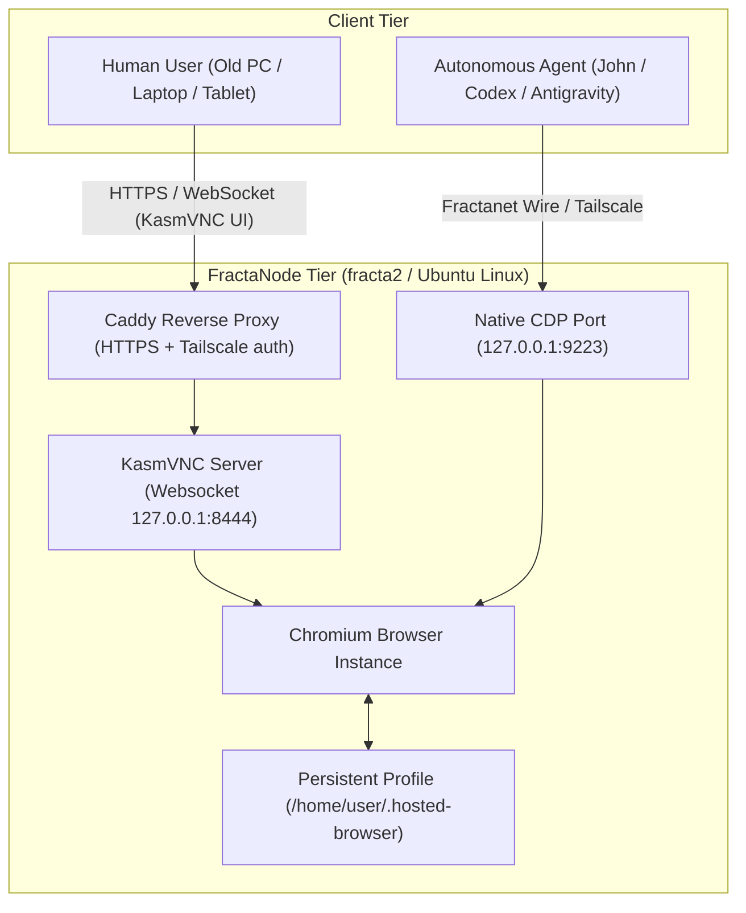

# Hosted Browser POC Architecture

## 1. Vision & Core Invariant

The Hosted Browser decouples personal browsing and agent automation from physical client hardware:

> **The personal environment belongs to the person, not to the physical terminal.**

A Hosted Browser session provides two symmetric access surfaces to the same underlying browser state:
1. **Human Interaction Surface**: Ultra low-latency web UI via **KasmVNC** (open-source GPL-2.0).
2. **Machine Automation Surface**: Scoped, local-only **Chrome DevTools Protocol (CDP)** for autonomous agents.

---

## 2. Multi-User Isolation & Security Constraints

* **Strict Unix Account Separation**: Each user operates under a dedicated Unix UID (e.g. `hosted-jhr`, `hosted-pilot`).
* **Profile Privacy**: `chmod 700 /home/${USER}/.hosted-browser`. Cookies, session tokens, and localStorage never leak across users.
* **CDP Scoping**: CDP is bound exclusively to `127.0.0.1` or the Fractanet Tailscale mesh. It is **never** exposed to the public Internet.
* **Exclusion of Kasm Workspaces**: The deployment intentionally uses only standalone **KasmVNC (GPL-2.0)** without proprietary Kasm Workspaces or heavy Docker/OCI layers.

---

## 3. Checkpoints & Verification Criteria

| Checkpoint | Target Property | Verification Method |
|---|---|---|
| **Checkpoint A** | Resilient FractaNode baseline | Host online on Tailscale mesh, zero swap pressure, monitored by Operium. |
| **Checkpoint B** | Persistent Single-User Session | Human logs into services (Gmail/ChatGPT), restarts systemd service, verifies session persistence. |
| **Checkpoint C** | Multi-User Independence | 2 separate users running simultaneously on distinct displays/ports with zero cross-talk. |
| **Checkpoint D** | Dual Human/Machine Control | Human interacts via KasmVNC while local script navigates and reads DOM via CDP. |

---

## 4. Resource Baseline & Performance Targets
 
* **Idle footprint per user**: ~180 MB RAM (Chromium base + KasmVNC daemon).
* **Active browsing footprint**: ~450 MB – 850 MB RAM per active tab cluster.
* **Network consumption**: ~15–40 KB/s during text typing/reading; ~120 KB/s on full redraws.

### Observed Live Baseline (`fracta2` — 2026-08-26)

| Parameter | Observed Live Value | Notes |
|---|---|---|
| **Host / OS** | `fracta2` · Ubuntu 24.04 LTS (x86_64) | OCI Marseille `VM.Standard.E2.1.Micro` |
| **KasmVNC** | v1.5.0-1 | Port :8444 / HTTP :80 via Caddy |
| **Chromium Engine** | Google Chrome 152.0.7977.64 | CDP :9223 active |
| **Window Manager** | Openbox lightweight WM | Minimal memory footprint |
| **Framerate & Codec** | 24 FPS · JPEG `quality: 6` | `nearest` video encoder, low CPU overhead |
| **Memory Allocation** | 1 GB RAM + 4 GB NVMe Swap | 432 MB free RAM nominal |
| **CPU Utilization** | **~91% CPU Idle (0% Steal)** | Stable under continuous session |
| **Control Plane** | ONA (:8794) + SOMA discovery | Advertises to fracta Blackboard every 3 min |
