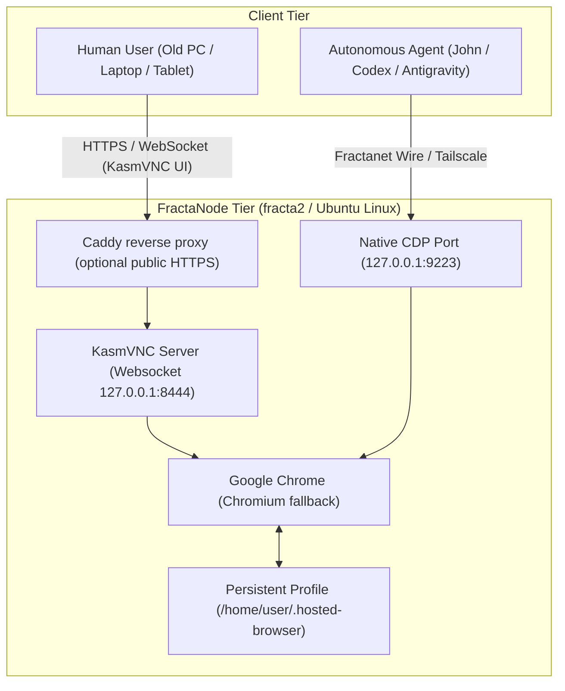

# Hosted Browser POC Architecture

## 1. Vision & Core Invariant

The Hosted Browser decouples personal browsing and agent automation from physical client hardware:

> **The personal environment belongs to the person, not to the physical terminal.**

A Hosted Browser session provides two symmetric access surfaces to the same underlying browser state:
1. **Human Interaction Surface**: Ultra low-latency web UI via **KasmVNC** (open-source GPL-2.0).
2. **Machine Automation Surface**: Scoped, local-only **Chrome DevTools Protocol (CDP)** for autonomous agents.



---

## 2. Multi-User Isolation & Security Constraints

* **Strict Unix Account Separation**: Each person gets a dedicated Unix UID (canonical form `hosted-<gmail-local-part-without-dots>`). Legacy names such as `hosted-jhr` remain valid until migrated.
* **Profile Privacy**: `chmod 700 /home/${USER}/.hosted-browser`. Cookies, session tokens, and localStorage never leak across users.
* **CDP Scoping**: CDP is bound exclusively to `127.0.0.1` or the Fractanet Tailscale mesh. It is **never** exposed to the public Internet.
* **Exclusion of Kasm Workspaces**: The deployment intentionally uses only standalone **KasmVNC (GPL-2.0)** without proprietary Kasm Workspaces or heavy Docker/OCI layers.

### Identities (do not conflate)

| Identity | What it is | What it is not |
|----------|------------|----------------|
| Unix account | Workspace owner UID, home, systemd `User=` | The KasmVNC login prompt |
| Hosted Browser workspace | Persistent Chrome profile + display + ports | A Cogentia Principal or Twin |
| KasmVNC user | HTTP Basic login in `~/.kasmpasswd` (Websockify realm) | Gmail, Unix, or Principal |
| Google / site sessions | Created by a human inside Chrome | Something the provisioner logs into |

Default isolation is **one person / one Unix workspace / one write-capable KasmVNC login**. Extra KasmVNC viewers on the same display are an explicit grant (`vncpasswd -u …`), not the way to give a second person their own browser.

### What the public password prompt is

Observed 2026-09-03: `https://browser.fractavolta.com/` returns **HTTP 401** `WWW-Authenticate: Basic realm="Websockify"` behind two Caddy hops. That prompt is **KasmVNC HTTP Basic** from the workspace `~/.kasmpasswd` file. It is not Unix `login(1)`, not Gmail, and not Cogentia.

Display `N` binds KasmVNC HTTP/WebSocket to `127.0.0.1:(8443+N)`, Chrome CDP to `127.0.0.1:(9222+N)`, optional RFB to `127.0.0.1:(5900+N)`. Display `:1` is therefore `:8444` / `:9223` / `:5901`. Only a chosen KasmVNC HTTP port may be published; RFB and CDP stay off the public Internet.

### Generic workspace provisioning

Use `scripts/ops/provision-hosted-browser-user.sh` after the node-level
KasmVNC templates are installed. It derives a stable Unix workspace from a
canonical Gmail address, allocates an explicit display, and requires existing
private KasmVNC and RFB password files. It never receives a Google password,
creates a Google account, or performs a Google sign-in.

Create those password files **before** provision, as root, with KasmVNC 1.5
`vncpasswd` (same tool as `kasmvncpasswd`). The `-u` name is the Websockify
login; prefer the workspace key, not the Gmail address, so the public prompt
does not display an email:

```bash
# Interactive; password min 6 chars. -w = keyboard/mouse. Skip -o unless this
# login should call the KasmVNC developer API.
sudo vncpasswd -u exampleperson -w /root/private/person.kasm
# Classic RFB file for the optional localhost x11vnc projection (#24).
sudo x11vnc -storepasswd /root/private/person.rfb
sudo chmod 600 /root/private/person.kasm /root/private/person.rfb
```

Then dry-run, then apply:

```bash
sudo scripts/ops/provision-hosted-browser-user.sh \
  --gmail person@gmail.com \
  --display 3 \
  --kasm-password-file /root/private/person.kasm \
  --rfb-password-file /root/private/person.rfb \
  --dry-run
```

Remove the final `--dry-run` only after confirming that the display is unused
and the supplied password files contain the intended private credentials. The
web-facing Caddy route is a separate operational decision: a newly provisioned
workspace is not automatically made public. Optional fragment:
`templates/hosted-browser/Caddyfile.browser.fragment`.

### List, rotate, revoke

```bash
sudo scripts/ops/list-hosted-browser-workspaces.sh
sudo scripts/ops/list-hosted-browser-workspaces.sh --json
```

Listing reads `/etc/operium/hosted-browser/*.env` and systemd active state. It
does not open password files.

**Rotate** the Websockify login by writing a new `vncpasswd` file, installing it
over `/home/<unix>/.kasmpasswd` (mode 0600, owner = workspace), and restarting
`hosted-browser@<unix>.service`. KasmVNC file edits are **not** applied live;
the developer API can change users without restart but is out of scope for this
MVP. Then sign in from a browser **outside** Tailscale to the published
hostname if that workspace is public.

**Revoke an extra KasmVNC viewer** (same workspace, not a second person):

```bash
sudo vncpasswd -u viewer -d /home/<unix>/.kasmpasswd
sudo systemctl restart hosted-browser@<unix>.service
```

**Disable a workspace** without deleting the credential-bearing Chrome profile:

```bash
sudo systemctl disable --now hosted-browser@<unix>.service
```

Do not `userdel -r` or delete `~/.hosted-browser` unless a human has accepted
loss of that profile. If a Caddy site was published for that display, remove
that site in the same change; provision never added it.

---

## 3. Checkpoints & Verification Criteria

| Checkpoint | Target Property | Verification Method |
|---|---|---|
| **Checkpoint A** | Resilient FractaNode baseline | Host online on Tailscale mesh, zero swap pressure, monitored by Operium. |
| **Checkpoint B** | Persistent Single-User Session | Human logs into services (Gmail/ChatGPT), restarts systemd service, verifies session persistence. |
| **Checkpoint C** | Multi-User Independence | 2 separate users running simultaneously on distinct displays/ports with zero cross-talk. |
| **Checkpoint D** | Dual Human/Machine Control | Human interacts via KasmVNC while local script navigates and reads DOM via CDP. |

---

## 4. Resource Baseline & Performance Targets
 
* **Idle footprint per user**: ~180 MB RAM (Chromium base + KasmVNC daemon).
* **Active browsing footprint**: ~450 MB – 850 MB RAM per active tab cluster.
* **Network consumption**: ~15–40 KB/s during text typing/reading; ~120 KB/s on full redraws.

### Observed Live Baseline (`fracta2` — 2026-08-26)

| Parameter | Observed Live Value | Notes |
|---|---|---|
| **Host / OS** | `fracta2` · Ubuntu 24.04 LTS (x86_64) | OCI Marseille `VM.Standard.E2.1.Micro` |
| **KasmVNC** | v1.5.0-1 | Port :8444 / HTTP :80 via Caddy |
| **Chromium Engine** | Google Chrome 152.0.7977.64 | CDP :9223 active |
| **Window Manager** | Openbox lightweight WM | Minimal memory footprint |
| **Framerate & Codec** | 24 FPS · JPEG `quality: 6` | `nearest` video encoder, low CPU overhead |
| **Memory Allocation** | 1 GB RAM + 4 GB NVMe Swap | 432 MB free RAM nominal |
| **CPU Utilization** | **~91% CPU Idle (0% Steal)** | Stable under continuous session |
| **Control Plane** | ONA (:8794) + SOMA discovery | Advertises to fracta Blackboard every 3 min |
