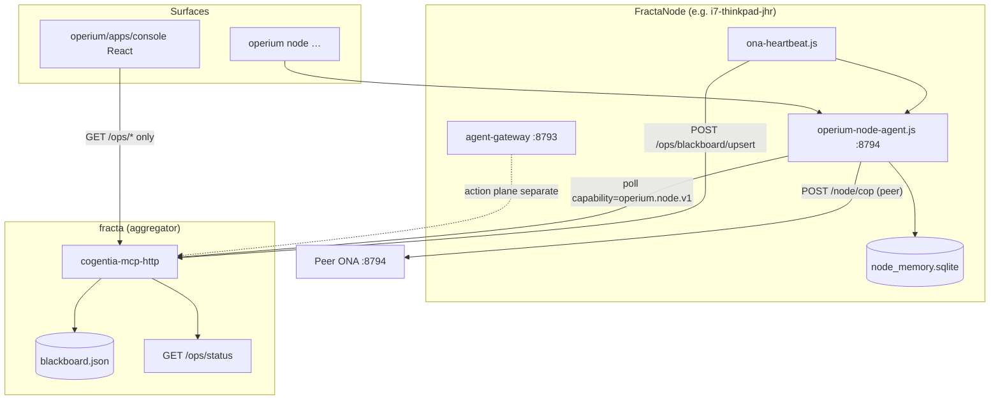
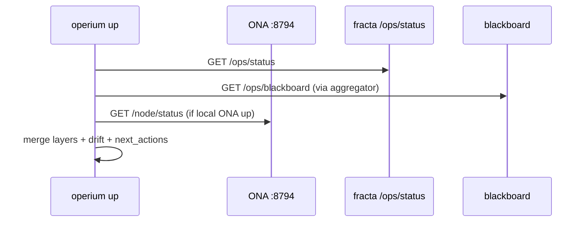
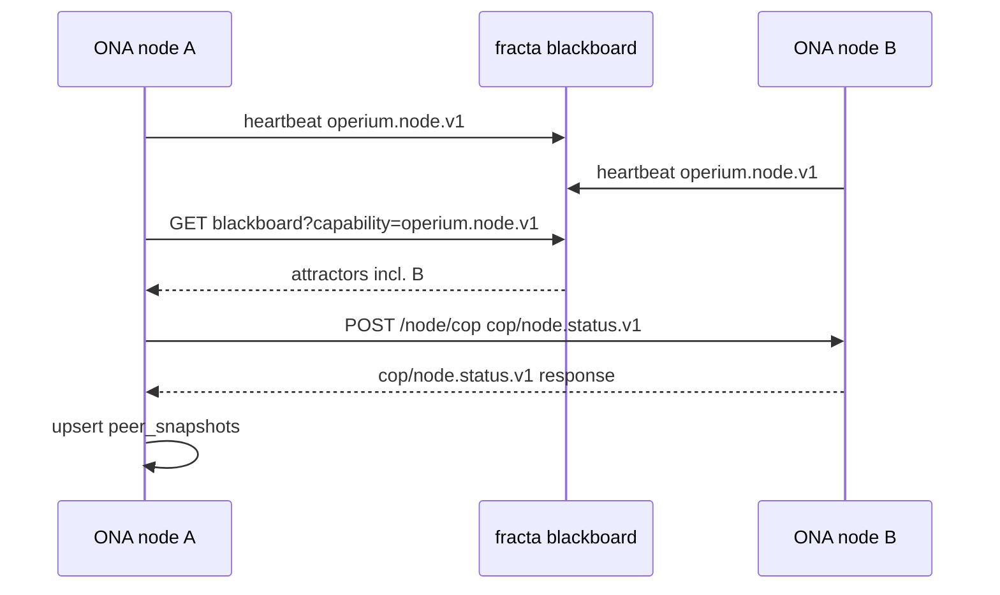

# Operium Node Agent (ONA)

## Title & Metadata

| Field | Value |
|-------|-------|
| **Document** | Operium Node Agent (ONA) — Design |
| **Author** | Jean Hugues Noël Robert (corpus); design draft by Grok |
| **Date** | 2026-07-10 |
| **Status** | **Draft** |
| **Repositories** | `operium` (daemon, CLI, console), `cogentia` (blackboard, aggregator, heartbeats), `registre-mariani` (catalogue) |
| **Canonical path** | `operium/docs/operium-node-agent.md` |

---

## Overview

Fractanet today has a **slow catalogue** (Operium YAML/Markdown in `registre-mariani/operium/registry/resources.yaml`), a **fast blackboard** (packet attractors on fracta via `cogentia/scripts/lib/packet-attractor-blackboard.js`), and an **observer CLI** (`operium up` → `operium.up.v1`). What is missing is a **per-node control-plane process** that maintains short-term operational memory, advertises node presence to the federation, routes COP-compliant control packets between peers, and exposes a stable local API for humans, agents, and dashboards.

**Operium Node Agent (ONA)** is that process: a **standalone daemon** listening on **`:8794`** on every FractaNode. ONA is **not** an Operia agent — Operia remains a future AI-assist layer over the catalogue, not an authority (`operium/docs/operia.md`). ONA is the **node-local control plane** for monitoring, supervising, and managing FractaNodes.

ONA stores **projections** in SQLite (per-OS path under `COGENTIA_OPS_STATE_DIR`; see Runtime dependencies). SQLite is **hot cache only** — durable truth remains Git registry + COP events on the blackboard. ONA discovers peers **exclusively via the fracta blackboard** (capability `operium.node.v1`); it does not scrape Tailscale peer lists for federation. The **action plane** (LLM/tool execution via `POST /ops/route/action` and agent-gateway `:8793`) stays separate from ONA's envelope routing.

Surfaces: HTTP API on `:8794`, extended `operium node …` CLI, structured logs, and a **Vite + React** web console in `operium/apps/console/` (UX/toolchain pattern inspired by `inseme/apps/platform` — **standalone** package, not a workspace copy).

---

## Background & Motivation

### Current state

| Layer | Location | Role | Temperature |
|-------|----------|------|-------------|
| **Catalogue (slow)** | `registre-mariani/operium/registry/resources.yaml` | Declared nodes, capabilities, secrets refs | Cold / frozen |
| **Blackboard (fast)** | `cogentia/.../blackboard.json` on fracta | Packet attractor advertisements | Hot / volatile |
| **Observer** | `operium/lib/operium-up.js` | Cross-layer drift, `next_actions` | Ephemeral (per invocation) |
| **Aggregator** | `GET /ops/status` via `cogentia-mcp-http` | Runtime snapshot on fracta | Warm projection |
| **Action plane** | `agent-gateway` `:8793`, `POST /ops/route/action` | Tool/LLM invocation | Hot session |
| **Static dashboard** | `cogentia/scripts/ops/fractanet-dashboard.html` | Human ops view | To be superseded |

Existing heartbeats (`attractor-heartbeat.js`, `agent-gateway-heartbeat.js`) publish **single-purpose** attractors (`retrieval.inline`, `agent.cli.gateway`) to the blackboard. `operium up` probes aggregator + Tailscale locally but **does not persist** probe history, peer snapshots, or COP packet queues on the node.

### Pain points

1. **No durable node-local memory** — each `operium up` run is stateless; operators cannot see "what changed on this node in the last hour."
2. **No inter-node control plane** — nodes cannot exchange structured `cop/node.*` envelopes without ad-hoc HTTP calls.
3. **Peer discovery does not scale** — Tailscale peer enumeration is useful for mesh drift (`operium/lib/drift.js`) but is not a federation registry; blackboard attractors are the intended Fractanet primitive (`inseme/research/packet_attractor_fractanet.md`).
4. **Observability gap** — logs are scattered across gateway files, heartbeat stdout, and MCP; no unified `event_log` per node.
5. **Dashboard debt** — static HTML dashboard cannot compose multi-node views or deep-link into node diagnostics.
6. **Issues backlog** — cogentia **#51** (diagnose + `next_actions` acceptance, `--human` polish) and **#52** (verify existing `route/action` on fracta, `operium invoke --via guide`) need a node-local anchor.

### Corpus constraints (non-negotiable)

```text
Blackboard (fast)  ≠  Catalogue (slow)  ≠  SQLite hot memory
Control plane      ≠  Action plane
ONA                ≠  Operia (AI assist, not authority)
SQLite             =  projection/cache, NOT truth
Trusted boundary   =  tailnet + admin tokens only
```

---

## Goals & Non-Goals

### Goals

| ID | Goal | Success metric |
|----|------|----------------|
| G1 | Run ONA as standalone daemon `:8794` on every FractaNode | Health endpoint returns `ok` within 500 ms p95 |
| G2 | SQLite hot memory with TTL-aware tables | Tables evict stale rows; no table exceeds configured row budget |
| G3 | Advertise `operium.node.v1` on fracta blackboard | Fresh attractor visible in `/ops/blackboard?capability=operium.node.v1` within 1 TTL cycle |
| G4 | Discover peers **only** via blackboard | Zero Tailscale peer-list calls in ONA peer discovery code path |
| G5 | COP control-plane packet types `cop/node.*.v1` | Round-trip `cop/node.status.v1` between two nodes in integration test |
| G6 | HTTP + CLI surfaces | `operium node status --json` matches `GET /node/status` schema |
| G7 | React console polling **fracta aggregator only** | Console renders fleet + node cards via `GET /ops/*` proxies; **no browser calls to remote peer `:8794`** |
| G8 | Include cogentia #51 and #52 deliverables | Acceptance criteria below; tests pass per embedded checklists |
| G9 | Align with `operium.up.v1` and COP memory profile | Temperature/TTL fields documented per table |

### Non-Goals (v1)

| ID | Non-Goal | Rationale |
|----|----------|-----------|
| NG1 | Embed ONA in `cogentia-mcp-http` | **Decided:** standalone `:8794` daemon |
| NG2 | Tailscale-based peer discovery | **Decided:** blackboard-only federation |
| NG3 | Replace Git/YAML catalogue as truth | Operium registry remains authoritative |
| NG4 | Operia AI diagnostics inside ONA | Future layer; ONA exposes data, not LLM reasoning |
| NG5 | Native Inox `PacketAttractor` runtime | Cogentia blackboard JSON store is sufficient for v1 |
| NG6 | Public WAN exposure of ONA | Tailnet/admin bind only |
| NG7 | Multi-master blackboard replication | fracta remains aggregation hub |
| NG8 | Full COP ledger / signed event chain on node | v1 uses outbox + HTTP; durable COP events deferred |

---

## Proposed Design

### High-level architecture



### Memory tier model (COP memory profile alignment)

Per `inseme/research/cop_memory_profile.md`:

| Tier | Store | ONA usage | Default temperature |
|------|-------|-----------|---------------------|
| Frozen | Git registry YAML | Read-only via `operium/lib/registry.js` | frozen |
| Cold | Blackboard events (fracta) | Poll + append via outbox | cold → warm on fetch |
| Hot | SQLite projections | Probe history, peer snapshots, inbox | hot / volatile |
| Durable (future) | COP event log (Git/topic) | `cop/node.event.v1` consolidation | write-through on consolidate |

**Rule:** SQLite rows carry `temperature`, `expires_at`, and `source_ref` (blackboard attractor id, probe id, or COP envelope id). Expired rows are evicted by a background sweeper every 60 s.

### Daemon: `operium-node-agent.js`

**Location:** `operium/bin/operium-node-agent.js` (entry) + `operium/lib/node-agent/*.js` (modules).

**Bind:** `127.0.0.1:8794` by default; `0.0.0.0:8794` when `ONA_BIND=all` and tailnet firewall confirmed.

**Hostname → catalogue node resolution** (order):

1. `ONA_HOSTNAME` env (explicit override)
2. Tailscale IP catalogue match — compare `tailscale status --json` Self IP to `transport.tailscale_ip` in `resources.yaml`
3. `os.hostname().toLowerCase()`
4. `process.env.COMPUTERNAME` (Windows fallback when hostname casing differs)

**Lifecycle:**

1. Load config from env + catalogue node entry (match resolved hostname → `resource_id`); persist resolved hostname to `local_state.hostname`.
2. **Fail fast** when `ONA_COP_DELIVERY=1` (default) and `ONA_PEER_TOKEN` is unset — log `missing_ona_peer_token` and exit before opening SQLite or binding HTTP (prevents silent admin-token fallback in cop-deliverer).
3. Open SQLite, run migrations (`operium/lib/node-agent/migrate.js`).
4. Start HTTP server (`operium/lib/node-agent/http-server.js`).
5. Start background workers:
   - **blackboard-sync** — poll fracta blackboard every 30 s for `operium.node.v1`
   - **self-probe** — local services probe every 60 s (extends `operium/lib/probes.js`; see v1 probe matrix below)
   - **ttl-sweeper** — evict expired rows every 60 s
   - **cop-deliverer** — drain `cop_outbox` to peer endpoints every 5 s
6. Register signal handlers (`SIGTERM` → withdraw attractor, flush outbox best-effort).

**Port allocation (FractaNode convention):**

| Service | Port | Plane |
|---------|------|-------|
| agent-gateway | 8793 | Action |
| **ONA** | **8794** | Control |
| inox-serve (typical) | 8792 | Retrieval |

### Runtime dependencies

| Dependency | Requirement | Notes |
|------------|-------------|-------|
| **SQLite binding** | `better-sqlite3` (preferred) or `node:sqlite` | PR 1 adds to `operium/package.json`; prefer sync `better-sqlite3` API; fall back to experimental `node:sqlite` (Node ≥22.5) if native build fails on edge nodes |
| **Node.js (daemon + CLI)** | **≥ 20** | Matches `operium/package.json` `engines`; fleet nodes run daemon only |
| **Node.js (console dev)** | **≥ 24** recommended | Vite 7 + Tailwind 4 toolchain; optional — not required on nodes without console dev |
| **RAM budget** | ~64 MB idle | HTTP server + SQLite + background workers; no LLM or embedding workloads |

### SQLite schema

**Path resolution** (`operium/lib/node-agent/paths.js`) mirrors `resolveBlackboardStorePath()` precedence in `packet-attractor-blackboard.js`: explicit env → platform default.

| OS / role | Default `COGENTIA_OPS_STATE_DIR` | `node_memory.sqlite` path |
|-----------|----------------------------------|---------------------------|
| Linux server (fracta) | `/var/lib/cogentia/.ops` | `/var/lib/cogentia/.ops/node_memory.sqlite` |
| Linux user install | `~/.cogentia/var` | `~/.cogentia/var/node_memory.sqlite` |
| Windows (thinkpad, etc.) | `%USERPROFILE%\.cogentia\var` | `%USERPROFILE%\.cogentia\var\node_memory.sqlite` |
| **Override** | `COGENTIA_OPS_STATE_DIR` | `{resolved_dir}/node_memory.sqlite` |

Logs follow the same base: `{resolved_dir}/../logs/ona.log` or `~/.cogentia/logs/ona.log` when using user defaults.

**Tables:**

#### `local_state` (singleton row, temperature: hot)

| Column | Type | Notes |
|--------|------|-------|
| `node_id` | TEXT PK | e.g. `resource://i7-thinkpad-jhr` |
| `hostname` | TEXT | **Resolved** catalogue hostname (from hostname→`node_id` resolution), not raw `os.hostname()` |
| `schema_version` | INTEGER | migration version |
| `started_at` | TEXT ISO | daemon start |
| `last_probe_at` | TEXT ISO | |
| `last_blackboard_sync_at` | TEXT ISO | |
| `health_score` | INTEGER 0–5 | mirrors `operium.up.v1` scale |
| `status_json` | TEXT | latest `operium.node.status.v1` blob |
| `updated_at` | TEXT ISO | |

TTL: none (singleton); overwritten each probe cycle.

#### `probe_history` (temperature: warm → cold)

| Column | Type | Notes |
|--------|------|-------|
| `id` | TEXT PK | `probe:<uuid>` |
| `probe_kind` | TEXT | `self`, `peer`, `aggregator`, `gateway` |
| `target` | TEXT | URL or hostname |
| `ok` | INTEGER | 0/1 |
| `latency_ms` | INTEGER | |
| `result_json` | TEXT | truncated JSON |
| `probed_at` | TEXT ISO | |
| `expires_at` | TEXT ISO | default `probed_at + 7d` |

Retention: max **500 rows** per node; oldest evicted first.

#### `peer_nodes` (temperature: warm)

| Column | Type | Notes |
|--------|------|-------|
| `attractor_id` | TEXT PK | e.g. `attractor:i7-thinkpad-jhr:operium-node` |
| `node_id` | TEXT | `resource://fracta` |
| `hostname` | TEXT | |
| `endpoint` | TEXT | resolved HTTP base, e.g. `http://100.91.12.74:8794` |
| `capabilities` | TEXT | JSON array |
| `status` | TEXT | `online`, `degraded`, `offline` |
| `last_seen` | TEXT ISO | from attractor |
| `ttl_seconds` | INTEGER | |
| `fresh` | INTEGER | 0/1 computed |
| `updated_at` | TEXT ISO | |

TTL: row deleted when attractor withdrawn or `expires_at` passed (derived from `last_seen + ttl_seconds`).

#### `peer_snapshots` (temperature: cold)

| Column | Type | Notes |
|--------|------|-------|
| `id` | TEXT PK | `snapshot:<node_id>:<iso>` |
| `node_id` | TEXT | peer |
| `snapshot_json` | TEXT | full `operium.node.snapshot.v1` |
| `fetched_at` | TEXT ISO | |
| `expires_at` | TEXT ISO | default `+24h` |

Retention: max **50 snapshots per peer**.

#### `cop_outbox` (temperature: hot, volatile until delivered)

| Column | Type | Notes |
|--------|------|-------|
| `id` | TEXT PK | envelope id |
| `packet_type` | TEXT | `cop/node.status.v1`, etc. |
| `target_node_id` | TEXT | **required in v1** — no broadcast; every outbox row must name a peer `node_id` |
| `envelope_json` | TEXT | full COP envelope |
| `state` | TEXT | `pending`, `delivered`, `failed` |
| `attempts` | INTEGER | |
| `next_attempt_at` | TEXT ISO | exponential backoff |
| `created_at` | TEXT ISO | |

Retention: delivered rows expire after **24 h**; failed after **7 d** or 10 attempts.

#### `cop_inbox` (temperature: hot)

| Column | Type | Notes |
|--------|------|-------|
| `id` | TEXT PK | envelope id |
| `packet_type` | TEXT | |
| `source_node_id` | TEXT | |
| `envelope_json` | TEXT | |
| `received_at` | TEXT ISO | |
| `handled_at` | TEXT ISO | nullable |
| `handler_result` | TEXT | JSON |
| `expires_at` | TEXT ISO | default `+48h` |

#### `invocation_log` (temperature: warm)

| Column | Type | Notes |
|--------|------|-------|
| `id` | TEXT PK | |
| `plane` | TEXT | `control` or `action` |
| `route` | TEXT | e.g. `POST /node/cop`, `POST /ops/route/action` |
| `ok` | INTEGER | |
| `summary` | TEXT | no secrets |
| `invoked_at` | TEXT ISO | |
| `expires_at` | TEXT ISO | default `+30d` |

Retention: max **1000 rows**.

#### `event_log` (temperature: warm)

| Column | Type | Notes |
|--------|------|-------|
| `id` | INTEGER PK AUTO | |
| `kind` | TEXT | `ona.started`, `peer.discovered`, `cop.received`, … |
| `detail_json` | TEXT | |
| `logged_at` | TEXT ISO | |
| `expires_at` | TEXT ISO | default `+14d` |

Retention: max **2000 rows**.

### Blackboard advertisement

ONA heartbeat (`operium/scripts/ona-heartbeat.js`, scheduled like `attractor-heartbeat.js`) **must probe local ONA before upsert** — same pattern as `agent-gateway-heartbeat.js`:

1. `GET http://127.0.0.1:8794/health` (override: `ONA_HEARTBEAT_URL`; timeout `ONA_HEARTBEAT_TIMEOUT_MS`, default 45 s)
2. On `ok: true` → advertise `availability.status: "online"` with `metadata.health_score` from probe or `GET /node/status`
3. On failure → advertise `availability.status: "degraded"` (still upsert so operators see stale endpoint) **or** publish `cop/attractor.withdrawn` when `ONA_ATTRACTOR_WITHDRAW=1` / shutdown path
4. Exit code `1` when degraded (cron/Task Scheduler visibility), `2` on missing env

Never upsert `online` without a successful local `/health` probe.

Publishes:

```json
{
  "event": "cop/attractor.advertised",
  "advertised_by": "resource://i7-thinkpad-jhr",
  "attractor": {
    "artifactType": "cop/packet-attractor",
    "id": "attractor:i7-thinkpad-jhr:operium-node",
    "node": { "resource_id": "resource://i7-thinkpad-jhr", "hostname": "i7-thinkpad-jhr" },
    "matches": { "capabilities": ["operium.node.v1"] },
    "availability": {
      "last_seen": "2026-07-10T12:00:00.000Z",
      "ttl_seconds": 300,
      "status": "online"
    },
    "transport": {
      "endpoint_ref": "http://100.x.x.x:8794",
      "profile": "operium.node.v1"
    },
    "metadata": {
      "ona_version": "0.1.0",
      "health_score": 4
    }
  }
}
```

Helper: `buildOperiumNodeAttractor()` in `operium/lib/node-agent/attractor.js`, mirroring `buildAgentCliGatewayAttractor()` in `packet-attractor-blackboard.js`. **Must** set `transport.profile: "operium.node.v1"` explicitly — `validateAttractor()` defaults to `inox.session.v1` when omitted.

**Heartbeat endpoint:** publish literal `http://<tailscale_ip>:8794` in `transport.endpoint_ref` (same pattern as `agent-gateway-heartbeat.js` using hostname/IP, not `secret://`). Resolve `<tailscale_ip>` from catalogue `transport.tailscale_ip` or `tailscale status --json` Self; never advertise unresolved secret refs to peers.

**Peer discovery algorithm** (`operium/lib/node-agent/peer-sync.js`):

1. `GET {COGENTIA_BLACKBOARD_URL}/ops/blackboard?capability=operium.node.v1&fresh=1`
2. Exclude self `attractor_id`
3. Accept only `http://<host-or-ip>:8794` endpoint refs; reject `secret://` for peer-sync (catalogue resolution is heartbeat-only)
4. Upsert `peer_nodes`; optionally fetch `GET /node/snapshot` from each fresh peer server-side (rate-limited: 1/min/peer)

**No Tailscale peer list** is used in this module. Tailscale data may still appear in `operium up` mesh layer for drift detection only.

### COP control-plane packet types

All envelopes follow COP envelope shape (artifact type, packet type, sender, recipient, payload, trace).

| Packet type | Direction | Purpose |
|-------------|-----------|---------|
| `cop/node.status.v1` | request/response | Lightweight health + schema version |
| `cop/node.query.v1` | request/response | Structured query (peers, probes, drift subset) |
| `cop/node.snapshot.v1` | response | Full node projection export |
| `cop/node.probe.v1` | request | Ask peer to run probe kind, return result |
| `cop/node.consolidate.v1` | request | Trigger TTL sweep + snapshot compaction |
| `cop/node.event.v1` | fire-and-forget | Operational event for peer `event_log` |

Example `cop/node.status.v1` response payload:

```json
{
  "schema": "operium.node.status.v1",
  "node_id": "resource://i7-thinkpad-jhr",
  "hostname": "i7-thinkpad-jhr",
  "ok": true,
  "health_score": 4,
  "ona_version": "0.1.0",
  "uptime_seconds": 86412,
  "peer_count_fresh": 3,
  "sqlite_stats": { "probe_history": 142, "cop_outbox_pending": 0 },
  "generated_at": "2026-07-10T12:00:00.000Z"
}
```

**Routing:** `POST /node/cop` on ONA accepts envelopes. Handler dispatches by `packet_type`, enqueues responses to `cop_outbox`. Cross-node delivery uses peer `endpoint` from `peer_nodes` with `Authorization: Bearer {ONA_PEER_TOKEN}`.

### v1 COP handler matrix

| Packet type | PR 5 handler | Phase 3 / deferred | Notes |
|-------------|--------------|---------------------|-------|
| `cop/node.status.v1` | **yes** | — | Request/response; updates `peer_snapshots` on inbound |
| `cop/node.query.v1` | **yes** | — | Structured query over `peer_nodes`, `probe_history`, `event_log` subsets |
| `cop/node.event.v1` | **yes** | — | Fire-and-forget; append to `event_log` |
| `cop/node.snapshot.v1` | stub `501` | **Phase 3** (PR 7) | Full projection export; HTTP `GET /node/snapshot` + COP handler in PR 7 |
| `cop/node.probe.v1` | stub `501` | **Phase 3** (post-PR 7) | Remote probe via COP; HTTP `POST /node/probe` (local self-probe trigger) ships in PR 6 |
| `cop/node.consolidate.v1` | stub `501` | Post-v1 | TTL sweep trigger |

Unknown `packet_type` → `400` with `unknown_packet_type`. Stubs return COP error envelope, not HTTP 404.

### HTTP API (`:8794`)

| Method | Path | Auth | Description |
|--------|------|------|-------------|
| `GET` | `/health` | See health auth table below | Liveness only — no projection payload |
| `GET` | `/node/status` | read token | `operium.node.status.v1` |
| `GET` | `/node/snapshot` | read token | Full projection: local_state + peers + recent probes |
| `GET` | `/node/peers` | read token | `peer_nodes` fresh list |
| `GET` | `/node/logs` | read token | Query `event_log` (`?kind=&limit=&since=`) |
| `POST` | `/node/cop` | peer/admin token | Accept COP envelope |
| `POST` | `/node/probe` | admin token | Trigger self-probe cycle |
| `GET` | `/node/drift` | read token | Node-local drift vs catalogue entry |

**Auth tokens:**

| Env var | Role |
|---------|------|
| `ONA_READ_TOKEN` | CLI, console read-only |
| `ONA_ADMIN_TOKEN` | probe, consolidate, config |
| `ONA_PEER_TOKEN` | inter-node COP — **required** when `ONA_COP_DELIVERY=1`; daemon **exits at boot** if unset; no fallback to admin token |

Reuse `timingSafeEqual` pattern from `packet-attractor-blackboard.js`.

**`GET /health` auth by bind mode:**

| Bind mode | Auth |
|-----------|------|
| `127.0.0.1:8794` (default) | No token — localhost trust boundary |
| `0.0.0.0:8794` (`ONA_BIND=all`) | Bearer `ONA_READ_TOKEN` or `ONA_ADMIN_TOKEN` required |
| `ONA_HEALTH_PUBLIC=1` | `/health` unauthenticated on any bind (liveness JSON only; no secrets or peer data) |

All other routes require tokens per table above regardless of bind mode.

### CLI extension

New command group in `operium/bin/operium.js`:

```bash
operium node status   [--json|--human] [--url http://127.0.0.1:8794]
operium node diagnose [--json|--human]  # extends operium up with local ONA + acceptance (#51)
operium node peers    [--json] [--fresh]
operium node logs     [--kind K] [--limit N]
operium node snapshot [--json] [--peer NODE_ID] [--fresh]
operium node query    --packet cop/node.query.v1 --payload '{...}' [--peer NODE_ID]
```

**`operium node snapshot --peer`** (default: read cache):

| Flag | Behaviour |
|------|-----------|
| _(none)_ | `GET /node/snapshot` — local projection |
| `--peer NODE_ID` | Read latest row from `peer_snapshots` SQLite cache for `NODE_ID`; exit `1` with `no_cached_snapshot` if none |
| `--peer NODE_ID --fresh` | Enqueue `cop/node.snapshot.v1` to `cop_outbox` for peer; wait for deliverer (timeout 30 s); upsert `peer_snapshots`; print fresh snapshot |

`--fresh` requires `ONA_COP_DELIVERY=1` and `ONA_PEER_TOKEN`; does not call peer `:8794` directly from CLI (COP outbox only).

**`operium node diagnose`** (cogentia **#51**) — acceptance criteria:

| # | Criterion | Verification |
|---|-----------|--------------|
| 51.1 | `operium node diagnose --json` emits schema `operium.node.diagnose.v1` | `scripts/test-operium-node-diagnose.js` |
| 51.2 | Composes `buildOperiumUp()` + local `GET /node/status` + `GET /node/drift` | Integration test on thinkpad + fracta fixture |
| 51.3 | `next_actions` merge: `unique([...operiumUp.next_actions, ...onaActions])` — operiumUp order preserved, ONA actions appended, duplicates removed | Assert in `operium.node.diagnose.v1.json` spec + unit test |
| 51.4 | Given stale blackboard fixture, `next_actions` includes heartbeat remediation string (e.g. attractor TTL expired) | `cogentia/scripts/test/fixtures/ops-status-stale-blackboard.json` |
| 51.5 | `--human` renders operator summary via `format-node-human.js` | Snapshot test in `scripts/test-operium-node-diagnose.js` |

**`operium invoke tool --via guide`** (cogentia **#52**) — acceptance criteria:

| # | Criterion | Verification |
|---|-----------|--------------|
| 52.1 | `POST /ops/route/action` **already implemented** in `cogentia-mcp-http.js` — deliverable is **ops verification**, not net-new route code | Production checklist in `cogentia/scripts/ops/deploy-route-action.md` |
| 52.2 | Runbook documents fracta verification: auth token, sample payload, expected `200` + action-plane response shape | Manual + scripted smoke on fracta |
| 52.3 | `operium invoke tool --via guide` routes through Guide MCP instead of direct blackboard endpoint resolve | `scripts/test-operium-invoke-via-guide.js` |
| 52.4 | Optional: ONA `invocation_log` records action-plane invocations when `OPERIUM_LOG_ACTIONS=1` on invoking host | `scripts/test-operium-invoke-via-guide.js` assertion |

### v1 self-probe matrix

Extend `operium/lib/probes.js` with `probeOnaServices(catalogue, options)` (PR 2). Current `probeLocalServices()` only probes `inox_serve`; ONA v1 requires:

| `probe_kind` | Target | v1 | Notes |
|--------------|--------|----|-------|
| `gateway` | `http://127.0.0.1:8793/health` | yes | Skip if node has no agent-gateway in catalogue |
| `aggregator` | `{COGENTIA_BLACKBOARD_URL origin}/ops/status` | yes if env set | Remote fracta aggregator reachability |
| `inox` | `{catalogue transport.local_url}/health` | yes | Port **8792** per registry |
| `ona` | `http://127.0.0.1:8794/health` | yes | Self liveness |

Each probe writes one `probe_history` row per cycle. Failures decrement `health_score` in `local_state`.

### React web console

**Location:** `operium/apps/console/` — **standalone** Vite app (pattern-inspired by `inseme/apps/platform`; does **not** depend on inseme workspace packages).

**Stack** (toolchain alignment only):

| Dependency | Version |
|------------|---------|
| `vite` | ^7.2.x |
| `react` / `react-dom` | ^18.3.x |
| `@vitejs/plugin-react` | ^4.3.x |
| `tailwindcss` | ^4.1.x |
| `@tailwindcss/vite` | ^4.1.x |

**Scripts:** `dev`, `build`, `preview`
**Dev Node:** ≥ 24 recommended (see Runtime dependencies).

**Critical constraint:** the browser **must not** poll remote peer ONA endpoints (`http://100.x.x.x:8794`). Cross-origin Tailscale calls would require per-peer CORS and would expose bearer tokens in client JS. All fleet reads go through **fracta aggregator** server-side proxies.

**Aggregator proxy auth (two-token model):**

| Hop | Token env | Role |
|-----|-----------|------|
| Browser → fracta `/ops/node/*` | `COGENTIA_OPS_READ_TOKEN` | Console / external ops read; sent as `Authorization: Bearer` from Vite build |
| fracta → peer ONA `:8794` | `ONA_READ_TOKEN` | Server-held only on fracta (or per-node secret from catalogue); **never** in browser bundle |
| Browser → fracta fleet views | _(none)_ | `GET /ops/status` and `GET /ops/blackboard` remain **public** (existing aggregator behaviour) |

Console build injects `VITE_COGENTIA_OPS_TOKEN` → runtime `Authorization` header for **authenticated** proxy routes only (`/ops/node/:node_id/*`). Fleet overview does not send a token.

**`:node_id` URL encoding (canonical):** Aggregator paths use **URL-encoded** `resource_id` as `:node_id`. Slashes and colons in `resource://…` must be percent-encoded.

| Logical `node_id` | Canonical path segment | Example full path |
|-------------------|------------------------|-------------------|
| `resource://i7-thinkpad-jhr` | `resource%3A%2F%2Fi7-thinkpad-jhr` | `GET /ops/node/resource%3A%2F%2Fi7-thinkpad-jhr/status` |
| `resource://fracta` | `resource%3A%2F%2Ffracta` | `GET /ops/node/resource%3A%2F%2Ffracta/drift` |

Console and CLI use `encodeURIComponent(node_id)` when building aggregator URLs. fracta `ona-proxy.js` decodes `:node_id` before blackboard lookup. **Do not** use raw `resource://…` in path segments (ambiguous parsing).

**Views (v1):**

1. **Fleet overview** — polls fracta `GET /ops/status` + `GET /ops/blackboard?capability=operium.node.v1` (**no auth token**)
2. **Node detail** — polls fracta `GET /ops/node/{encodeURIComponent(node_id)}/status` with `COGENTIA_OPS_READ_TOKEN`; fracta proxies to peer ONA with `ONA_READ_TOKEN`
3. **Drift panel** — `GET /ops/node/{encodeURIComponent(node_id)}/drift` (same two-token model)
4. **Action layer status** — read-only `GET /ops/status` action-plane slice (no invoke from browser v1)

**Hosting & CORS (OQ5 resolved):** Production console static assets are served from fracta **same-origin** (e.g. `https://cogentia.fractavolta.com/ops/console/` or `/console/`) so browser `fetch('/ops/…')` needs no CORS preflight. Local `vite dev` uses proxy below. If console is hosted on a **different origin**, that origin must appear in fracta `COGENTIA_CORS_ORIGIN` (comma-separated, same pattern as `cogentia-mcp-http.js`).

**Dev proxy** (`vite.config.js`):

```javascript
proxy: {
  '/ops': 'https://cogentia.fractavolta.com',  // fleet + node proxy paths
  // '/node' → local ONA ONLY when developing ONA on this host (not used for remote peers)
  '/node': 'http://127.0.0.1:8794',
}
```

Console production build: set `VITE_COGENTIA_OPS_BASE_URL` (fracta origin) and `VITE_COGENTIA_OPS_TOKEN` (`COGENTIA_OPS_READ_TOKEN` value) at build time for node-detail views only.

Replaces `cogentia/scripts/ops/fractanet-dashboard.html` as the recommended dashboard; static HTML retained until console GA.

### Integration with `operium.up.v1`

ONA does not replace the observer. Relationship:



`operium node diagnose` adds `layers.node_agent` to the merged result. **`next_actions` merge** (cogentia #51):

```javascript
next_actions = unique([...operiumUp.next_actions, ...onaActions])
// operiumUp actions first; ONA-derived actions appended; duplicate strings removed
```

```json
{
  "schema": "operium.node.diagnose.v1",
  "next_actions": ["...", "..."],
  "layers": {
    "node_agent": {
      "ok": true,
      "url": "http://127.0.0.1:8794",
      "health_score": 4,
      "peer_count_fresh": 3,
      "last_blackboard_sync_at": "..."
    }
  }
}
```

### Sequence: peer status exchange



---

## API / Interface Changes

### New: ONA HTTP (`:8794`)

See HTTP API table above. JSON schemas live in `operium/schemas/`:

- `operium.node.status.v1.json`
- `operium.node.snapshot.v1.json`
- `operium.node.diagnose.v1.json`
- `operium.node.peers.v1.json`

### New: COP packet types

Registered in `operium/docs/cop-node-packets.md` (v1 appendix); packet type prefix `cop/node.*`.

### Extended: `operium` CLI

| Before | After |
|--------|-------|
| `operium up` only | `operium node status`, `diagnose`, `peers`, `logs`, `snapshot`, `query` |
| `operium invoke tool` | adds `--via guide` (#52) |

### Extended: blackboard attractor builders

| File | Addition |
|------|----------|
| `operium/lib/node-agent/attractor.js` | `buildOperiumNodeAttractor()` |
| `cogentia/scripts/lib/packet-attractor-blackboard.js` | optional import re-export for tests |

### Extended: fracta aggregator (cogentia-mcp-http)

| Method | Path | Auth | Description |
|--------|------|------|-------------|
| `GET` | `/ops/node/:node_id/status` | `COGENTIA_OPS_READ_TOKEN` | Server-side proxy to peer ONA `GET /node/status` via blackboard `endpoint_ref` |
| `GET` | `/ops/node/:node_id/drift` | `COGENTIA_OPS_READ_TOKEN` | Proxy to peer ONA `GET /node/drift` (when endpoint exists) |

`:node_id` is URL-encoded `resource_id` (see React console encoding table). `ona-proxy.js` decodes, resolves attractor, forwards with `Authorization: Bearer {ONA_READ_TOKEN}`.

| Token | Where set | Used for |
|-------|-----------|----------|
| `COGENTIA_OPS_READ_TOKEN` | fracta env / secrets | Validates browser → fracta on `/ops/node/*` only |
| `ONA_READ_TOKEN` | fracta env (peer read) | fracta → peer ONA `:8794` |
| `VITE_COGENTIA_OPS_TOKEN` | console build-time | Same value as `COGENTIA_OPS_READ_TOKEN`; baked into static bundle for node-detail fetches |

`GET /ops/status` and `GET /ops/blackboard` remain **unauthenticated** (fleet overview). Browser never receives `ONA_READ_TOKEN`.

### Unchanged (explicit)

| Interface | Note |
|-----------|------|
| `GET /ops/status` | Still runtime aggregator; gains optional `layers.node_agents` (**blackboard-derived only**) in phase 4 |
| `POST /ops/route/action` | Action plane; **already exists** in `cogentia-mcp-http.js`; #52 is verification + CLI |
| `operium.up.v1` schema | Backward compatible; new fields only in diagnose composite |

---

## Data Model Changes

### New file: `node_memory.sqlite`

- Created on first ONA start
- Migrations versioned in `operium/lib/node-agent/migrations/`
- **Not** committed to git
- Backup: optional `ona dump --output snapshot.json` exports non-secret projection

### Catalogue (`resources.yaml`)

Add per-node ONA stanza (example):

```yaml
operium_node_agent:
  port: 8794
  attractor_id: attractor:i7-thinkpad-jhr:operium-node   # pattern: attractor:<hostname>:operium-node
  capabilities:
    - operium.node.v1
  secrets_file: /srv/cogentia/secrets/ona.env
```

### Blackboard

No schema change — uses existing `cop/packet-attractor` validation in `validateAttractor()`.

### Migration strategy

1. Deploy ONA on fracta first (always-on aggregator + blackboard host)
2. Deploy on capable laptop (`i7-thinkpad-jhr`)
3. Roll to `poco-jhr`, `rpi3-view` as bootstrap completes
4. SQLite migrations are forward-only; downgrade = stop daemon + delete sqlite (cache loss acceptable)

---

## Alternatives Considered

### Alternative A: Embed ONA in `cogentia-mcp-http`

| Pros | Cons |
|------|------|
| Single process on fracta | Couples node agent to MCP release cycle |
| Shared blackboard store handle | Cannot run on nodes without full cogentia stack |
| Fewer open ports | Violates per-node uniformity (RPi, laptop need local agent) |

**Rejected** — user decision: standalone `:8794`.

### Alternative B: Tailscale peer-list peer discovery

| Pros | Cons |
|------|------|
| Works offline from fracta | Does not encode capabilities or TTL |
| Already in `probeTailscale()` | Centralized mesh view; not Fractanet packet attractor pattern |
| Simple iteration over peers | Scales poorly; no legitimacy/capacity binding per packet_attractor spec |

**Rejected** — user decision: blackboard-only from day one.

### Alternative C: PostgreSQL / Supabase for node memory

| Pros | Cons |
|------|------|
| Central query across nodes | Violates hot-local-cache principle |
| Rich SQL analytics | Network dependency for every probe write |
| | Conflicts with intermittent nodes |

**Rejected** — SQLite hot projection per node aligns with COP memory profile cache tier.

### Alternative D: Static HTML dashboard only (extend `fractanet-dashboard.html`)

| Pros | Cons |
|------|------|
| Zero build step | No multi-node composition |
| Already deployed | Harder to test and version |
| | Does not match inseme platform UX patterns |

**Rejected** — Vite + React console in operium repo.

---

## Security & Privacy Considerations

### Threat model

| Threat | Mitigation |
|--------|------------|
| Unauthenticated ONA access on tailnet | Bearer tokens (`ONA_READ_TOKEN`, `ONA_ADMIN_TOKEN`, `ONA_PEER_TOKEN`); bind `127.0.0.1` default; `/health` auth per bind mode |
| COP envelope injection | Validate packet_type allowlist; peer token on `POST /node/cop` |
| Secret leakage via logs | `invocation_log` stores summaries only; no env dumps |
| SQLite tampering | Projections only; cross-check against blackboard + catalogue on diagnose |
| Replay of COP packets | Envelope `id` dedup in `cop_inbox`; `received_at` skew window 5 min |

### Trust perimeter

- ONA endpoints reachable only on **Tailscale** or **localhost**
- Aligns with `operium/docs/fracta-trust-perimeter.md`
- **No** public WAN bind without explicit `ONA_BIND=all` + firewall + token

### Auth

Reuse patterns from:

- `hasBlackboardUpsertAuth()` — `cogentia/scripts/lib/packet-attractor-blackboard.js`
- `hasActionRouteAuth()` — `cogentia/scripts/lib/agent-gateway-route.js`

### Data handling

- SQLite may contain peer hostnames, probe latencies, drift facts — **no secret values**
- `peer_snapshots` may cache peer `operium.node.snapshot.v1` — treat as **operational confidential**
- GDPR/personal data: node ops metadata only; no end-user PII in v1

---

## Observability

### Logging

| Stream | Destination | Format |
|--------|-------------|--------|
| Daemon stdout | `~/.cogentia/logs/ona.log` or systemd | JSON lines |
| `event_log` table | SQLite | queryable via `/node/logs` |
| Heartbeat | cron/Task Scheduler stdout | JSON one-liner |

**Structured fields:** `ts`, `level`, `kind`, `node_id`, `duration_ms`, `error`

### Metrics (v1 minimal)

Expose on `GET /node/status` → `sqlite_stats`, `peer_count_fresh`, `cop_outbox_pending`, `uptime_seconds`.

Future: Prometheus `/metrics` behind feature flag.

### Alerting hooks

| Condition | `event_log` kind | Suggested action |
|-----------|------------------|------------------|
| Blackboard sync failed 3× | `blackboard.sync_failed` | Check `COGENTIA_BLACKBOARD_URL` |
| `cop_outbox` pending &gt; 50 | `cop.backlog_high` | Inspect peer connectivity |
| No fresh peers 15 min | `peer.island` | Verify fracta + heartbeats |
| `health_score` &lt; 3 | `health.degraded` | Run `operium node diagnose --human` |

### Integration with `operium up`

`next_actions` in diagnose path references ONA kinds when `layers.node_agent.ok === false`.

---

## Rollout Plan

### Phase 0 — Design acceptance (this document)

- Review with operator; freeze key decisions (already final).

### Phase 1 — Core daemon (fracta + one laptop)

- Ship `operium-node-agent.js`, SQLite migrations, `/health`, `/node/status`
- `ona-heartbeat.js` → blackboard `operium.node.v1`
- Feature flag env: `ONA_ENABLED=1`

### Phase 2 — Peer COP + CLI

- `peer-sync`, `POST /node/cop`, `operium node peers|status|logs`
- Integration test: fracta ↔ laptop status exchange

### Phase 3 — Drift endpoint, diagnose + issues #51/#52

- `GET /node/drift` on ONA (prerequisite for diagnose)
- `operium node diagnose --human` (#51 acceptance)
- Verify `POST /ops/route/action` on fracta (already implemented; ops checklist #52)
- `operium invoke tool --via guide` (#52)

### Phase 4 — React console

- `operium/apps/console` MVP fleet + node views
- Deprecate static dashboard link in docs

### Phase 5 — Fleet rollout

| Node | Priority | Notes |
|------|----------|-------|
| fracta | P0 | Aggregator + first ONA |
| i7-thinkpad-jhr | P0 | Capable dev host |
| poco-jhr | P1 | Agent gateway + ONA |
| rpi3-view | P2 | Edge kiosk, read-only console |
| rpi4-tailscale | P2 | After bootstrap |

### Feature flags

| Flag | Default | Effect |
|------|---------|--------|
| `ONA_ENABLED` | `0` | systemd/task installs but daemon exits |
| `ONA_PEER_FETCH` | `1` | Auto-fetch peer snapshots |
| `ONA_COP_DELIVERY` | `1` | Deliver outbox to peers; requires `ONA_PEER_TOKEN` (fail fast at boot if missing) |

### Rollback

1. Set `ONA_ENABLED=0`
2. Stop systemd unit / Task Scheduler `OperiumNodeAgent`
3. Run heartbeat withdraw (`COGENTIA_ATTRACTOR_WITHDRAW=1` pattern)
4. Optional: remove `node_memory.sqlite` (cache only)

---

## Open Questions

| ID | Question | Owner | Target |
|----|----------|-------|--------|
| OQ1 | Should `GET /ops/status` embed fresh `operium.node.v1` attractor summary without polling each ONA? | cogentia | Phase 4 |
| OQ2 | ~~Resolve `secret://` endpoint refs in ONA~~ **Resolved:** heartbeat publishes literal `http://<tailscale_ip>:8794`; peer-sync accepts HTTP only | operium | Phase 2 |
| OQ3 | Windows service vs Task Scheduler for ONA on thinkpad? | ops | Phase 1 |
| OQ4 | Signed COP envelopes (ed25519) for `cop/node.event.v1`? | inseme/COP | Post-v1 |
| OQ5 | ~~Console hosted on fracta static path vs local-only dev?~~ **Resolved:** production console served same-origin from fracta (`/ops/console/` or `/console/`); cross-origin dev requires `COGENTIA_CORS_ORIGIN` entry; `VITE_COGENTIA_OPS_TOKEN` for authenticated node-detail routes only | operium | Phase 4 |

---

## References

| Document | Path |
|----------|------|
| Operia boundary | `operium/docs/operia.md` |
| Operium CLI / `operium.up.v1` | `operium/docs/operium-cli.md` |
| Operational health scale | `operium/docs/operational-health.md` |
| Packet Attractor spec | `inseme/research/packet_attractor_fractanet.md` |
| COP memory profile | `inseme/research/cop_memory_profile.md` |
| Private catalogue | `registre-mariani/operium/registry/resources.yaml` |
| Blackboard implementation | `cogentia/scripts/lib/packet-attractor-blackboard.js` |
| Ops status aggregator | `cogentia/scripts/lib/fractanet-ops-status.js` |
| Action route | `cogentia/scripts/lib/agent-gateway-route.js` |
| Observer | `operium/lib/operium-up.js` |
| Drift + next_actions | `operium/lib/drift.js` |
| Attractor heartbeat | `cogentia/scripts/ops/attractor-heartbeat.js` |
| Gateway heartbeat | `cogentia/scripts/ops/agent-gateway-heartbeat.js` |
| Legacy dashboard | `cogentia/scripts/ops/fractanet-dashboard.html` |
| Vite platform reference | `inseme/apps/platform/package.json` |
| cogentia issue #51 | Diagnose, acceptance `next_actions`, `--human` |
| cogentia issue #52 | Verify `route/action` on fracta, `operium invoke --via guide` |

---

## Key Decisions (with rationale)

| Decision | Rationale |
|----------|-----------|
| **Standalone ONA daemon on `:8794`** | Every FractaNode needs a uniform control-plane process independent of cogentia-mcp-http release cadence; keeps action plane (`:8793`) separate. |
| **Blackboard-only peer discovery** | Aligns with Packet Attractor federation pattern; scalable capability matching; avoids Tailscale as implicit service registry. |
| **SQLite as hot projection** | Matches COP memory profile cache tier; works offline; intermittent nodes can still accumulate local traces. |
| **Name: Operium Node Agent, not Operia agent** | Preserves Operia = future AI assist over catalogue, not operational authority. |
| **Vite + React console in operium** | Modern testable UI; toolchain aligned with inseme platform (React 18, Vite 7, Tailwind 4) but **standalone** — no inseme workspace deps. |
| **Aggregator-mediated console reads** | Browser cannot safely poll remote `:8794`; fracta proxies `GET /ops/node/{encoded_id}/status` with `COGENTIA_OPS_READ_TOKEN` (browser) → `ONA_READ_TOKEN` (server). |
| **Two-token aggregator auth** | Separates console read scope from peer ONA credentials; fleet `/ops/status` stays public. |
| **URL-encoded `:node_id`** | Canonical path form for `resource://` ids; avoids ambiguous path parsing. |
| **Heartbeat health gate** | `ona-heartbeat.js` probes local `/health` before `online` advertisement. |
| **Explicit `ONA_PEER_TOKEN`** | Peer COP is a distinct trust boundary; no silent admin-token fallback. |
| **COP `cop/node.*.v1` control packets** | Distinct from action-plane tool invocation; enables inter-node supervision without agent-gateway. |
| **fracta as blackboard hub (no replication v1)** | Existing `blackboard.json` store is proven; multi-master deferred. |

---

## PR Plan

Ordered incremental PRs across **operium** and **cogentia** repositories.

### CLI → endpoint → PR dependency matrix

| CLI command | ONA HTTP endpoint | Aggregator proxy | Minimum PR |
|-------------|-------------------|------------------|------------|
| _(daemon boot)_ | `GET /health` | — | PR 1 |
| `operium node status` | `GET /node/status` | `GET /ops/node/{encoded_id}/status` (console) | PR 2 / PR 14 |
| `operium node peers` | `GET /node/peers` | blackboard via `GET /ops/blackboard` | PR 4 |
| `operium node logs` | `GET /node/logs` | — (CLI-local v1) | PR 6 |
| `operium node snapshot` | `GET /node/snapshot` / `peer_snapshots` cache / `cop/node.snapshot.v1` | — | PR 7 |
| `operium node snapshot --peer --fresh` | _(COP outbox)_ | — | PR 7 |
| `POST /node/probe` | `POST /node/probe` | — | PR 6 |
| `operium node diagnose` | `GET /node/status` + **`GET /node/drift`** | — | **PR 8** (requires PR 7 drift) |
| `operium node query` | `POST /node/cop` | — | PR 5 |
| `operium invoke tool --via guide` | — (action plane) | `POST /ops/route/action` verify | PR 9 |
| Console fleet view | — | `GET /ops/status`, `GET /ops/blackboard` | PR 10 + PR 14 |
| Console node detail | — | **`GET /ops/node/{encoded_id}/status`** | PR 14 |

**Ordering rule:** `GET /node/drift` (PR 7) **before** `operium node diagnose` (PR 8).

### PR 1 — `operium`: ONA scaffold + SQLite migrations

| Field | Value |
|-------|-------|
| **Title** | `feat(ona): add node-agent daemon scaffold and SQLite schema` |
| **Repo** | operium |
| **Files** | `bin/operium-node-agent.js`, `lib/node-agent/{paths,migrate,db,http-server,config}.js`, `lib/node-agent/migrations/001_initial.sql`, `schemas/operium.node.status.v1.json`, `scripts/test-ona-db.js`, `package.json` |
| **Dependencies** | None |
| **Description** | Boot HTTP server on `:8794`, `GET /health`, create `node_memory.sqlite` with all tables, unit tests for migrations. Add `better-sqlite3` (or `node:sqlite` fallback) + Node `>=20` to `package.json`. No blackboard yet. |

### PR 2 — `operium`: local state + self-probe worker

| Field | Value |
|-------|-------|
| **Title** | `feat(ona): self-probe worker and GET /node/status` |
| **Repo** | operium |
| **Files** | `lib/node-agent/{probe-worker,status,local-state}.js`, extend `http-server.js`, `scripts/test-ona-status.js` |
| **Dependencies** | PR 1 |
| **Description** | Extend `probes.js` with `probeOnaServices()` (gateway, aggregator, inox:8792, ona self); write `probe_history` + `local_state`; implement `operium.node.status.v1`. |

### PR 3 — `operium`: blackboard attractor + heartbeat

| Field | Value |
|-------|-------|
| **Title** | `feat(ona): operium.node.v1 blackboard advertisement` |
| **Repo** | operium |
| **Files** | `lib/node-agent/attractor.js`, `scripts/ona-heartbeat.js`, `scripts/ops/install-ona-heartbeat-windows.ps1`, `docs/operium-node-agent.md` (ops section) |
| **Dependencies** | PR 2 |
| **Description** | `buildOperiumNodeAttractor()` with explicit `transport.profile: operium.node.v1`; `ona-heartbeat.js` probes `GET /127.0.0.1:8794/health` before upsert (degraded or withdraw on failure, mirror `agent-gateway-heartbeat.js`); publishes `http://<tailscale_ip>:8794`; hostname resolution order documented; env docs. |

### PR 4 — `operium`: peer sync (blackboard-only)

| Field | Value |
|-------|-------|
| **Title** | `feat(ona): blackboard peer discovery and GET /node/peers` |
| **Repo** | operium |
| **Files** | `lib/node-agent/peer-sync.js`, `lib/node-agent/ttl-sweeper.js`, `scripts/test-ona-peer-sync.js` |
| **Dependencies** | PR 3 |
| **Description** | Poll `capability=operium.node.v1`; upsert `peer_nodes`; **no Tailscale peer enumeration**; TTL sweeper. |

### PR 5 — `operium`: COP inbox/outbox + POST /node/cop

| Field | Value |
|-------|-------|
| **Title** | `feat(ona): COP control-plane routing cop/node.*.v1` |
| **Repo** | operium |
| **Files** | `lib/node-agent/{cop-handler,cop-deliverer,envelope}.js`, `docs/cop-node-packets.md`, `schemas/cop/node.*.json`, `scripts/test-ona-cop-roundtrip.js` |
| **Dependencies** | PR 4 |
| **Description** | v1 handler matrix: implement `cop/node.status.v1`, `cop/node.query.v1`, `cop/node.event.v1`; stub `501` for `snapshot`/`probe`/`consolidate` (Phase 3); outbox requires `target_node_id` (no broadcast v1); delivery with backoff; boot fail-fast when `ONA_COP_DELIVERY=1` and `ONA_PEER_TOKEN` unset. |

### PR 6 — `operium`: CLI `operium node status|peers|logs` + `POST /node/probe`

| Field | Value |
|-------|-------|
| **Title** | `feat(cli): operium node status, peers, logs; POST /node/probe` |
| **Repo** | operium |
| **Files** | `bin/operium.js`, `lib/node-cli.js`, `lib/node-agent/probe-route.js`, `lib/format-node-human.js`, `scripts/test-operium-node-cli.js`, `scripts/test-ona-probe-route.js` |
| **Dependencies** | PR 5 |
| **Description** | HTTP client to local ONA; `operium node status|peers|logs` with `--json` / `--human`; implement `POST /node/probe` (admin token) triggering self-probe cycle + `scripts/test-ona-probe-route.js`. Snapshot CLI deferred to PR 7. |

### PR 7 — `operium`: GET /node/snapshot + /node/drift

| Field | Value |
|-------|-------|
| **Title** | `feat(ona): snapshot export and catalogue drift endpoint` |
| **Repo** | operium |
| **Files** | `lib/node-agent/{snapshot,drift}.js`, `schemas/operium.node.snapshot.v1.json`, `scripts/test-ona-drift.js` |
| **Dependencies** | PR 6 |
| **Description** | `GET /node/snapshot`; `operium node snapshot` (+ `--peer` reads `peer_snapshots` cache, `--fresh` enqueues `cop/node.snapshot.v1`); implement COP handler for `cop/node.snapshot.v1` (remove PR 5 stub); node-local drift vs `resources.yaml` using `operium/lib/drift.js` subset. **Must land before diagnose (PR 8).** |

### PR 8 — `operium` + `cogentia`: diagnose + issue #51 acceptance

| Field | Value |
|-------|-------|
| **Title** | `feat(ona): operium node diagnose and next_actions acceptance (#51)` |
| **Repo** | operium (+ minor cogentia test fixture) |
| **Files** | `lib/node-diagnose.js`, `lib/format-node-human.js`, `schemas/operium.node.diagnose.v1.json`, `scripts/test-operium-node-diagnose.js`, `cogentia/scripts/test/fixtures/ops-status-stale-blackboard.json` |
| **Dependencies** | PR 7 |
| **Description** | Merge `buildOperiumUp()` + ONA layers + `GET /node/drift`; `next_actions` = `unique(operiumUp + onaActions)`; acceptance test for stale blackboard; `--human` output. |

### PR 9 — `cogentia` + `operium`: route/action verification + invoke --via guide (#52)

| Field | Value |
|-------|-------|
| **Title** | `feat(ops): verify route/action on fracta and operium invoke --via guide (#52)` |
| **Repo** | cogentia, operium |
| **Files** | `cogentia/scripts/ops/deploy-route-action.md`, `cogentia/scripts/test-route-action-smoke.js`, `operium/lib/invoke-tool.js`, `operium/bin/operium.js`, `operium/lib/node-agent/invocation-log.js`, `scripts/test-operium-invoke-via-guide.js` |
| **Dependencies** | PR 6 (parallel ok with PR 8) |
| **Description** | **No new route handler** — `POST /ops/route/action` exists in `cogentia-mcp-http.js`; deliver ops verification runbook + smoke test; `--via guide` flag; optional `invocation_log` on ONA host. |

### PR 10 — `operium`: React console MVP

| Field | Value |
|-------|-------|
| **Title** | `feat(console): Vite React Operium node console` |
| **Repo** | operium |
| **Files** | `apps/console/{package.json,vite.config.js,index.html,src/**}`, `docs/operium-console.md` |
| **Dependencies** | PR 14 (aggregator proxy), PR 8 |
| **Description** | Standalone Vite app (inseme-inspired, not workspace copy). Fleet + node views poll **fracta `/ops/*` only** — no remote peer `:8794` from browser. Build-time `VITE_COGENTIA_OPS_TOKEN` + `VITE_COGENTIA_OPS_BASE_URL`; same-origin deploy on fracta per OQ5. |

### PR 11 — `registre-mariani`: catalogue ONA stanzas

| Field | Value |
|-------|-------|
| **Title** | `chore(registry): add operium_node_agent to node entries` |
| **Repo** | registre-mariani |
| **Files** | `operium/registry/resources.yaml` |
| **Dependencies** | PR 3 |
| **Description** | Document port 8794, attractor ids, secrets refs for fracta, thinkpad, poco-jhr. |

### PR 12 — `cogentia`: ops status optional node_agents layer

| Field | Value |
|-------|-------|
| **Title** | `feat(ops): expose operium.node.v1 attractor count in /ops/status` |
| **Repo** | cogentia |
| **Files** | `scripts/lib/fractanet-ops-status.js`, `scripts/test-packet-attractor-blackboard.js` |
| **Dependencies** | PR 4 |
| **Description** | Add `layers.node_agents: { fresh_count, attractors[] }` to aggregator output — **blackboard-derived only** (no HTTP probe storm to every `:8794`); backward compatible. |

### PR 14 — `cogentia`: aggregator ONA proxy routes (console prerequisite)

| Field | Value |
|-------|-------|
| **Title** | `feat(ops): proxy GET /ops/node/:node_id/status for console` |
| **Repo** | cogentia |
| **Files** | `scripts/cogentia-mcp-http.js`, `scripts/lib/ona-proxy.js`, `scripts/test-ona-proxy.js` |
| **Dependencies** | PR 4 |
| **Description** | `ona-proxy.js`: decode URL-encoded `:node_id`; validate `COGENTIA_OPS_READ_TOKEN` on ingress; forward with `ONA_READ_TOKEN`; proxy `GET /node/status` and `GET /node/drift`; document encoding examples; enables React console without browser peer polling. |

### PR 13 — ops: fleet install runbooks

| Field | Value |
|-------|-------|
| **Title** | `docs(ops): ONA systemd and Windows service install runbooks` |
| **Repo** | operium, cogentia |
| **Files** | `operium/docs/operium-node-agent-install.md`, `cogentia/scripts/ops/install-ona-systemd.sh` |
| **Dependencies** | PR 10, PR 14 |
| **Description** | Production rollout to fracta + thinkpad; rollback procedure; deprecate static dashboard primary link. |

---

*End of design document.*
